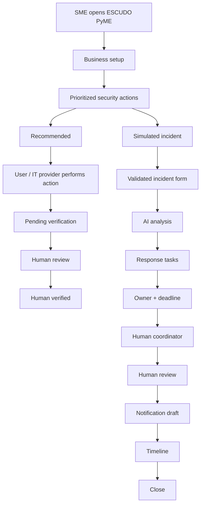
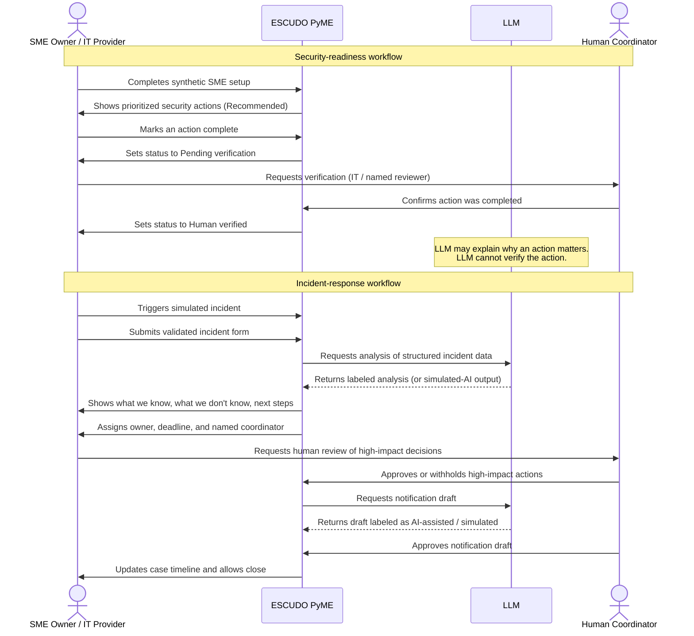

# ESCUDO PyME — Week 8 Business Bending Packet

Miguel Bravo  
Role: TECHNOLOGIST

Declared vacuum: SME SHIELD  
Working slice: Readiness-to-response bridge for a Mexican SME.

---

## 1. Problem in my own words

Mexican SMEs do not need another antivirus or another dashboard full of technical alerts.

Basic cybersecurity controls already exist, but a small business without a cybersecurity team still struggles to answer:

- What matters first?
- Has this control actually been completed?
- Who is responsible?
- What do we do when something goes wrong?
- Who makes serious decisions?

ESCUDO PyME attacks that gap.

It turns existing cybersecurity practices into a short, understandable workflow and adds a human-verified incident-response path when a possible breach occurs.

The product does not replace existing security technology.

It helps a small business understand, prioritize, verify and respond.

---

## 2. Exact user

Primary user:  
Owner or manager of a small Mexican business with digital exposure but no internal cybersecurity team.

Demo company:  
Clínica Sonrisa CDMX.

This is fictional.

Characteristics:

- 15–30 employees
- 2–3 locations
- email
- cloud files
- clinic management system
- handles patient information
- no cybersecurity team
- external IT provider

Operational actor:  
External IT provider.

Human safeguard:  
Named incident-response coordinator.

ALL demo people, businesses, incidents and data are synthetic.

---

## 3. Success definition

Before the module closes, a user at a public ESCUDO PyME URL can:

1. Complete synthetic SME setup.
2. See 3–5 prioritized security actions.
3. Distinguish:
   - RECOMMENDED
   - PENDING VERIFICATION
   - HUMAN VERIFIED
4. Trigger a simulated incident.
5. Submit a validated incident form.
6. Receive labeled AI or simulated-AI analysis.
7. See:
   - WHAT WE KNOW
   - WHAT WE DON'T KNOW
   - RECOMMENDED NEXT STEPS
8. Assign an owner.
9. Assign a deadline.
10. See a named human coordinator.
11. Require human verification before high-impact decisions.
12. Produce a notification draft.
13. View a case timeline.

The app must NEVER say:  
“You are safe.”

Success means:  
The user understands what should happen next, who owns it, and what still requires verification.

---

## 4. Image-generated mockup

An image-generated mobile mockup was created in ChatGPT before implementation.

The image will later be added as:

`docs/mockups/escudo-pyme-mockup.png`

That file is not in this repository yet. This packet does not claim the PNG exists.

Visual direction of the generated mockup (to be added later):

- professional, premium, simple, phone-first
- navy / indigo / white
- understandable by a nontechnical SME owner

Screens represented in the generated mockup:

1. Landing
2. Company onboarding
3. Security dashboard
4. Action detail
5. Simulated incident
6. Incident form
7. AI analysis
8. Human review

---

## 5. Mermaid flowchart

---

## 6. Mermaid swimlane

---

## 7. Global benchmark

Benchmark patterns:

- **Cyber Essentials:** simple and verifiable security baseline.
- **Huntress-style managed security:** small organizations buy expertise instead of building a SOC.
- **Coalition-style incident response:** readiness connected to organized response.

ESCUDO PyME localizes the pattern through:

- Spanish-first UX
- Mexican SME context
- low complexity
- clear action ownership
- verification states
- incident-response handoff
- visible human verification

This packet does not claim ESCUDO PyME is technologically superior to those products.

---

## 8. Three-year view

ESCUDO PyME could become a lightweight cybersecurity operating layer for Mexican SMEs and their IT providers. Over three years it could connect to real security signals, approved service partners, insurers and compliance evidence while preserving the rule that AI recommends and humans verify high-impact decisions. Its potential moat is not proprietary antivirus technology but the verified history of actions, response workflows and evidence showing whether safeguards are actually being operated.

---

## 9. Scope cut

DO NOT BUILD:

- antivirus
- password manager
- malware engine
- autonomous incident response
- ransom payment
- attacker negotiation
- universal security score
- real breached personal data
- password collection
- private key collection
- raw patient file collection
- legal advice
- automatic compliance certification
- real government breach lookup
- enterprise SOC
- autonomous notification sending

---

## 10. Dragon Stack

DRAGON STACK:

LLM  
+  
STRUCTURED SECURITY DATA  
+  
AUTOMATION

**LLM:**  
Used for explanation, summarization, prioritization and notification drafting.

If no real API exists, use deterministic simulated output.

It MUST visibly say:

“Salida simulada de IA”

Never pretend a real model ran.

**STRUCTURED SECURITY DATA:**  
Create local structured data for:

- security controls
- incident types
- recommended actions

Do not let the LLM freely invent the security framework.

**AUTOMATION:**

Security action states:

Recommended  
→ Pending verification  
→ Human verified

Incident states:

Incident created  
→ AI analysis  
→ Tasks assigned  
→ Human review  
→ Notification  
→ Closed

---

## 11. Architecture

Use:

- React
- Vite
- TypeScript

Hosting later:  
Vercel

Validation:  
Zod if useful.

State:  
Local demo state.

Do not add Supabase unless persistence becomes necessary.

Phone-first:  
approximately 390px.

Desktop must also work.

---

## 12. Security Floor

MANDATORY:

- No secrets in repository.
- Create `.env.example` if necessary.
- Gitignore: `.env`, `.env.local`
- Use synthetic data only.
- Never request: passwords, private keys, raw patient documents, real breach databases.
- Validate every form.
- Minimize LLM inputs.
- AI cannot count as human verification.
- Never claim the organization is safe.

---

## 13. Shadow clause

Every incident must leave:

- ONE named human coordinator.
- ONE prioritized next action.
- ONE owner.
- ONE deadline.
- Human verification before irreversible/high-impact action.
- A useful communication path for affected people.

CORE RULE:

“AI may accelerate understanding. AI may not accelerate irreversible harm.”

---

## 14. Test plan

### Mechanical Test

Prepare this section now. Perform it later (not in this packet-creation session).

Later we will test:

- desktop
- 390px mobile
- onboarding
- validation
- actions
- verification states
- simulated incident
- AI labeling
- owner
- deadline
- human review
- notification
- timeline
- refresh/navigation
- production build

Do not invent a bug. A real bug must be found during actual testing.

### Persona Test

Prepare this section now. Do not perform it yet.

Persona:

María, 49.  
Owner of a two-location dental clinic in Mexico City.

She uses WhatsApp, email and banking apps but does not understand cybersecurity terminology.

She depends on an external IT provider and may abandon software if she thinks she could accidentally damage something.

Do not invent persona feedback.
